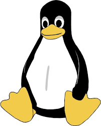

#Kocham warsztat programisty
##Oto powody dlaczego:

Jako pierwsze wymienię to jak kocham linuxa

Jako drugie wymienię to jak świetnym narzędziem jest stepik

Jako ostatnie wymienię świetne opracowanie programu


*Pochylone* **GRUBE** ~~przekreślone~~


> Per aspera ad astra

1. pierwszy
2. obiekt
3. lista
    1. Wciety blok
    2. Ten tez
4. I kolejny item
5. no dobra jeszcze jeden


- raz
- dwa
- trzy
    - baba
    - jaga
- patrzy


```

X = [[12,7],[4 ,5],[3 ,8]]

result = [[0,0,0],[0,0,0]]

for i in range(len(X)):
   for j in range(len(X[0])):
       result[j][i] = X[i][j]

for r in result:
   print(r)

```


Aby uzyskać informacje wpisz `!info`



